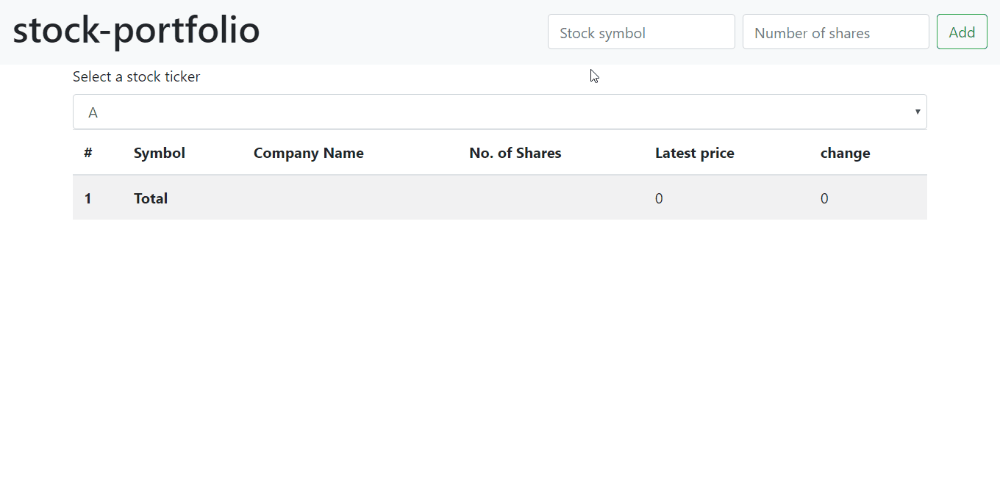

# Stock Portfolio

This is a simple front-end application to check stocks and their prices. There is functionality to track several stocks together and view the current status of portfolio.

## Demo



This project was bootstrapped with [Create React App](https://github.com/facebook/create-react-app).

## Installation

clone this project into your preferred folder and then run it on a server. should have `node` installed.

```
git clone https://github.com/abodhare/stock-portfolio.git
cd stock-portfolio
npm install
npm install -g serve
serve -s build
```
In order for the site to work, you mush have a valid IEX cloud API token. Include it in you `env.local` file in the main directory by adding
```
REACT_APP_MY_TOKEN=YOUR_TOKEN_HERE
```
to it.

you can check out the application at `localhost:5000`.

## Deployment

You can make any necessary changes and deploy it to your preferred platform by following the guides on [Create React App](https://github.com/facebook/create-react-app).

## Built with

[React](https://reactjs.org/) - for the front end
[Redux](https://redux.js.org/) - for managing state across components
[Bootstrap](https://getbootstrap.com/) - for styling and responsive layout

## Authors

* **Akshay Bodhare** - [abodhare](https://github.com/abodhare)

## License

This project is licensed under the MIT License - see the [LICENSE.md](LICENSE.md) file for details
